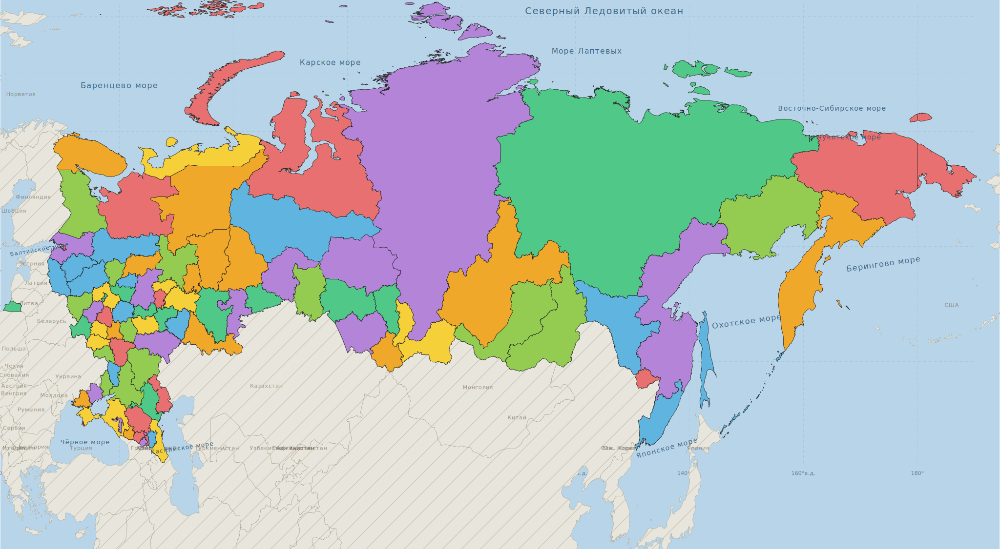

# Интерактивная карта России — План разработки

## Что это за проект
Офлайн браузерное приложение (file://) — карта России с кликабельными регионами.
Клик по региону → боковая панель со списком файлов (видео, фото, документы).
**Никаких фреймворков, никакого сервера** — чистый HTML + CSS + JS.

---

## Текущий стек файлов (E:\karta\)

| Файл | Что делает | Статус |
|---|---|---|
| `index.html` | Основная страница, загружает все скрипты | ✅ Готов |
| `style.css` | Стили (тёмный хедер, боковая панель, маркеры) | ✅ Готов |
| `russia.svg` | Карта России 2022 (846KB, viewBox 0 0 20955 11530) | ✅ Есть, но без ID регионов |
| `regions.js` | Координаты подписей регионов (`const REGIONS = [...]`) | ✅ Обновлён под новый SVG, 83 региона |
| `config.js` | Координаты городов-маркеров (`const CONFIG = {...}`) | ✅ 14 городов (включая ДНР/ЛНР/Запорожская/Херсон) |
| `map.js` | Логика: маркеры, боковая панель, debug-режим | ✅ Работает |
| `открыть.bat` | Запускает index.html в браузере | ✅ Готов |

---

## Текущее состояние карты
- Карта отображается корректно, все 89+ регионов видны визуально (разными цветами)
- **Надписи регионов ОТКЛЮЧЕНЫ** (`buildRegionLabels()` — пустая функция)
- **Маркеры городов ОТКЛЮЧЕНЫ** (`buildMarkers()` — пустая функция)
- Боковая панель работает, но открывается только из кода (нет кликабельных элементов)

### SVG-карта (russia.svg)
- Источник: Wikipedia 2022 — включает ДНР, ЛНР, Запорожскую, Херсонскую
- **Проблема**: у `<path>` нет атрибутов `id` — нельзя идентифицировать регион по клику
- Загружается как `` — нельзя кликать по отдельным путям внутри

### Координатная система в map.js
```js
const SVG_X0 = 103,  SVG_Y0 = 103;
const SVG_W  = 20326, SVG_H  = 10508;
```
Формула перевода географических координат → SVG:
```
x = 103 + (lon - 20) / 170 * 20326
y = 103 + (81 - lat) / 40 * 9667
```

---

## Главная задача — СЛЕДУЮЩИЙ ШАГ

### Цель: сделать каждый регион кликабельным по отдельности

**Выбранный подход: GeoJSON → новый SVG с ID + инлайн загрузка**

#### Шаг 1 — Python-скрипт `build_svg.py` (запускается один раз разработчиком)
- Скачивает GeoJSON с границами всех 89 регионов России
- Конвертирует в SVG где каждый регион = `<path id="RU-MOW" data-name="Москва">`
- Выводит новый `russia.svg`

GeoJSON источник (на выбор):
- https://raw.githubusercontent.com/codeforamerica/click_that_hood/master/public/data/russia.geojson
- Или GADM Level 1 данные для России

#### Шаг 2 — Изменить загрузку SVG: `` → инлайн SVG
В `index.html` вместо:
```html

```
Загружать SVG инлайн (fetch + innerHTML) или через `<object>`.

#### Шаг 3 — Переписать `map.js`
- Убрать систему overlay-маркеров (div поверх img)
- Слушать клики напрямую на `<path>` элементах SVG
- `path.addEventListener('click', () => openSidebar(regionId))`
- Убрать `svgToScreen()` / `getImageRect()` — больше не нужны

#### Шаг 4 — Привязать регионы к данным в `config.js`
Изменить структуру config.js:
```js
const CONFIG = {
  regions: {
    "RU-MOW": {
      name: "Москва",
      files: [{ name: "...", path: "..." }]
    },
    "RU-SPE": {
      name: "Санкт-Петербург", 
      files: []
    },
    // ... все 89 регионов
  }
};
```

---

## Регионы которых НЕ ХВАТАЕТ в regions.js (сейчас 83, нужно 89)

| ID | Регион |
|---|---|
| RU-ARK | Архангельская область |
| RU-TYU | Тюменская область |
| RU-CR | Республика Крым |
| RU-MOW | Москва (город фед. значения) |
| RU-SPE | Санкт-Петербург (город фед. значения) |
| RU-SEV | Севастополь |

---

## Что НЕ ТРОГАТЬ
- `style.css` — устраивает полностью
- Цвета SVG-карты — пользователь сказал "не трогать пока"
- Структуру `index.html` (хедер, боковая панель) — менять только способ загрузки SVG

---

## Итоговая архитектура (после всех изменений)

```
E:\karta\
├── index.html          # Загружает SVG инлайн через fetch
├── style.css           # Без изменений
├── russia.svg          # Новый SVG с id на каждом <path>
├── config.js           # Данные по регионам (89 штук) + файлы
├── map.js              # Клики на SVG paths, открытие сайдбара
├── build_svg.py        # Скрипт генерации SVG (запускать один раз)
├── открыть.bat
└── locations/          # Папки с файлами по регионам
    ├── Москва/
    ├── Санкт-Петербург/
    └── ...
```

---

## Для нового чата — вставить это в начало

> Я разрабатываю офлайн-карту России (E:\karta\). 
> Стек: HTML + CSS + JS, никаких фреймворков, работает через file://.
> Текущий SVG (russia.svg) — карта 2022 года включая ДНР/ЛНР/Запорожскую/Херсонскую, 
> но у путей нет id-атрибутов, загружается как .
> 
> Задача: сделать каждый из 89 регионов кликабельным по отдельности.
> Подход: написать build_svg.py (GeoJSON → SVG с id на каждом регионе),
> переключить загрузку SVG с  на инлайн, 
> переписать map.js чтобы кликать напрямую по <path> элементам.
> 
> Прочитай файлы: E:\karta\index.html, map.js, config.js, style.css
> и файл E:\karta\ПЛАН.md с полным описанием проекта.
